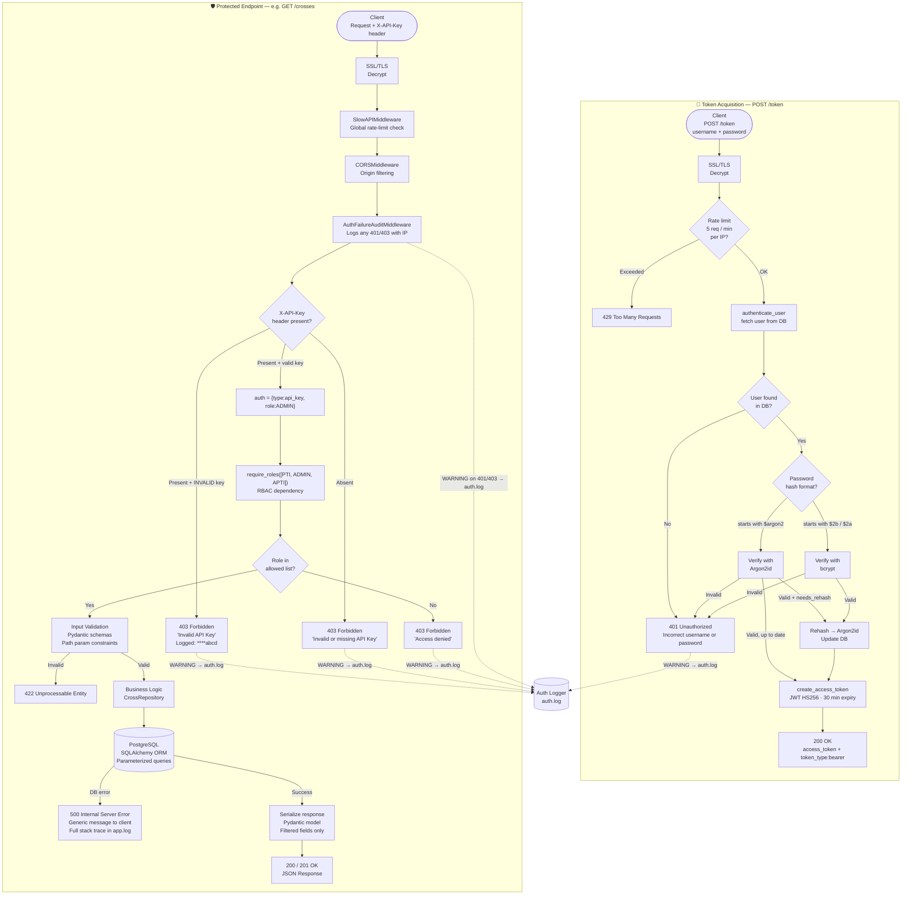

# WarriorFit API

A secure **FastAPI** backend application for managing running events with comprehensive authentication, role-based access control, and SSL/TLS encryption.

## 📋 Table of Contents

- [Overview](#overview)
- [Features](#features)
- [Security Architecture](#security-architecture)
- [Request Flow](#request-flow)
- [Authentication & Authorization](#authentication--authorization)
- [SSL/TLS Certificates](#ssltls-certificates)
- [Installation](#installation)
- [API Documentation](#api-documentation)
- [Endpoint Schema](#endpoint-schema)
- [Database Schema](#database-schema)
- [Testing](#testing)
- [Project Structure](#project-structure)

---

## Overview

WarriorFit API is a running event management system that provides secure RESTful endpoints to register participants, track finish times, and manage cross recordings during running events.

**Key Technologies:**
- **Backend**: FastAPI (Python 3.14+)
- **Database**: PostgreSQL with asyncpg
- **ORM**: SQLAlchemy (async)
- **Authentication**: OAuth2 + JWT + API Key
- **Password Hashing**: Argon2id (stronger than bcrypt)
- **HTTP Client**: httpx
- **Package Manager**: uv
- **Containerization**: Docker

---

## Features

### Core Features
- 🏃 **Runner Registration** - Register participants for running events
- ⏱️ **Time Tracking** - Record and manage finish times
- 📊 **Cross Management** - Track cross recordings for events
- 🎯 **Event Management** - Access and manage event data

### Security Features
- 🔐 **Dual Authentication** - OAuth2 (JWT tokens) + API Key
- 🛡️ **Role-Based Access Control (RBAC)** - PTI, ADMIN, APTI roles
- 🔒 **Argon2id Password Hashing** - Military-grade encryption
- 🔄 **Automatic Password Migration** - Bcrypt → Argon2id on login
- 📜 **SSL/TLS Encryption** - Self-signed certificates with validation
- ✅ **Certificate Validation** - Automatic checks on startup

---

## Security Architecture

### 🏗️ Multi-Layer Security Model

```
┌─────────────────────────────────────────────────────────────┐
│                      Client Request                         │
└────────────────────────┬────────────────────────────────────┘
                         │
                         ▼
┌─────────────────────────────────────────────────────────────┐
│                   SSL/TLS Layer (HTTPS)                     │
│  • 4096-bit RSA encryption                                  │
│  • Self-signed certificate with SANs                        │
│  • Automatic validation on startup                          │
└────────────────────────┬────────────────────────────────────┘
                         │
                         ▼
┌─────────────────────────────────────────────────────────────┐
│              Authentication Layer                           │
│                                                             │
│  ┌──────────────────┐       ┌──────────────────┐            │
│  │   API Key Auth   │       │   OAuth2 Auth    │            │
│  │   (Header)       │       │   (JWT Token)    │            │
│  └────────┬─────────┘       └────────┬─────────┘            │
│           │                          │                      │
│           └───────────┬──────────────┘                      │
└───────────────────────┼─────────────────────────────────────┘
                        │
                        ▼
┌─────────────────────────────────────────────────────────────┐
│             Authorization Layer (RBAC)                      │
│  • Check user role: PTI, ADMIN, or APTI                     │
│  • Check user is active                                     │
│  • API keys are assigned ADMIN role                         │
└────────────────────────┬────────────────────────────────────┘
                         │
                         ▼
┌─────────────────────────────────────────────────────────────┐
│                  API Endpoint                               │
│  • Business logic                                           │
│  • Database operations                                      │
└─────────────────────────────────────────────────────────────┘
```
Security details audit : [SECURITY](SECURITY.md)

---

## Request Flow

Two distinct flows exist: acquiring a JWT token via `/token`, and calling any protected endpoint with an API key.



---

## Authentication & Authorization

### 🔑 Authentication Methods

The API supports **two authentication methods**:

#### 1. API Key Authentication (Full Access)

**Use case:** Server-to-server communication, admin scripts, full access

**How it works:**
- Static API key in configuration
- Assigned the `ADMIN` role (subject to RBAC like all users)
- Invalid API keys are rejected immediately (no fallback to OAuth2)

**Configuration** (`src/config/config.yml`):
```yaml
api:
  secret_key: warriorfit_cross_the_world  # Your API key
```

**Usage:**
```bash
curl -X GET "https://localhost:8555/crosses" \
  -H "X-API-Key: warriorfit_cross_the_world" \
  --cacert src/certs/cert.pem
```

**Python example:**
```python
import httpx

client = httpx.Client(verify="./src/certs/cert.pem")
response = client.get(
    "https://localhost:8555/crosses",
    headers={"X-API-Key": "warriorfit_cross_the_world"}
)
```

#### 2. OAuth2 Password Flow (Role-Based Access)

**Use case:** User authentication, role-based access control

**How it works:**
1. User sends username + password to `/token`
2. Server validates credentials (Argon2id hash verification)
3. Server returns JWT access token (30 min expiration)
4. Client includes token in `Authorization` header
5. Server validates token and checks user role

**Step 1: Login**
```bash
curl -X POST "https://localhost:8555/token" \
  -H "Content-Type: application/x-www-form-urlencoded" \
  -d "username=your_username&password=your_password" \
  --cacert src/certs/cert.pem
```

**Response:**
```json
{
  "access_token": "eyJhbGciOiJIUzI1NiIsInR5cCI6IkpXVCJ9...",
  "token_type": "bearer"
}
```

**Step 2: Use Token**
```bash
curl -X GET "https://localhost:8555/crosses" \
  -H "Authorization: Bearer YOUR_ACCESS_TOKEN" \
  --cacert src/certs/cert.pem
```

**Python example:**
```python
from test_api_client import WarriorFitClient

client = WarriorFitClient(
    base_url="https://localhost:8555",
    cert_path="./src/certs/cert.pem"
)

# Login
client.login("username", "password")

# Use authenticated client
crosses = client.get_crosses()
```

### 🛡️ Authorization (Role-Based Access Control)

#### Allowed Roles

Only users with these roles can access the API:

| Role | Access | Description |
|------|--------|-------------|
| **PTI** | ✅ Full | Physical Training Instructor |
| **ADMIN** | ✅ Full | Administrator |
| **APTI** | ✅ Full | Assistant Physical Training Instructor |
| USER | ❌ Denied | Standard user |
| GUEST | ❌ Denied | Guest user |
| PLANNER | ❌ Denied | Event planner |

#### How Authorization Works

```python
# src/main.py - Authorization flow

1. Request arrives with OAuth2 token
2. Token is validated and decoded
3. User information is fetched from database
4. User role is checked against allowed roles: ["PTI", "ADMIN", "APTI"]
5. User active status is verified
6. If authorized → Allow access
7. If unauthorized → HTTP 403 Forbidden
```

**Error Responses:**

```json
// Wrong role
{
  "detail": "Access denied. Required roles: PTI, ADMIN, APTI"
}

// Inactive user
{
  "detail": "User account is inactive"
}

// No authentication
{
  "detail": "Not authenticated"
}
```

### 🔐 Password Security

#### Argon2id Hashing

**Why Argon2id?**
- Winner of Password Hashing Competition (2015)
- Stronger than bcrypt, scrypt, and PBKDF2
- Memory-hard algorithm (resistant to GPU/ASIC attacks)
- Side-channel attack protection

**Configuration:**
```python
# Default parameters (src/core/oauth2.py)
time_cost: 3 iterations
memory_cost: 65536 KiB (64 MiB)
parallelism: 4 threads
algorithm: Argon2id (hybrid mode)
```

**Comparison:**

| Algorithm | Memory Usage | GPU Resistant | Status |
|-----------|--------------|---------------|--------|
| **Argon2id** | 64 MiB | ✅ Strong | Current |
| bcrypt | ~4 KB | ⚠️ Moderate | Legacy support |
| PBKDF2 | Minimal | ❌ Weak | Not used |

#### Automatic Password Migration

When users with old bcrypt passwords log in, their passwords are automatically upgraded to Argon2id:

```python
# Login flow
1. User sends username + password
2. System checks password hash format
3. If bcrypt → Verify with bcrypt
4. If valid → Rehash with Argon2id
5. Update database with new hash
6. Next login → Use Argon2id (stronger!)
```

---

## SSL/TLS Certificates

### 🔒 Certificate Architecture

The API uses **self-signed SSL certificates** for encrypted HTTPS communication.

**Certificate Specifications:**
- **Algorithm**: RSA 4096-bit
- **Signature**: SHA-256
- **Validity**: 365 days
- **Format**: PEM
- **Location**: `src/certs/`

**Subject Alternative Names (SANs):**
- DNS: `localhost`
- DNS: `*.localhost`
- IP: `127.0.0.1`
- IP: `0.0.0.0`

### 📜 Certificate Generation

#### Create New Certificate

```bash
cd /home/benoit/PycharmProjects/CrossClientAPIWarriorFit

openssl req -x509 -newkey rsa:4096 -nodes \
  -keyout src/certs/key.pem \
  -out src/certs/cert.pem \
  -days 365 \
  -subj "/C=BE/ST=Brussels/L=Brussels/O=WarriorFit/OU=IT/CN=localhost" \
  -addext "subjectAltName=DNS:localhost,DNS:*.localhost,IP:127.0.0.1,IP:0.0.0.0"

# Set proper permissions
chmod 600 src/certs/key.pem  # Private key (read-only by owner)
chmod 644 src/certs/cert.pem # Certificate (readable by all)
```

#### Verify Certificate

```bash
# Check certificate details
openssl x509 -in src/certs/cert.pem -noout -text | grep -E "(Subject:|Issuer:|Not Before|Not After|DNS:|IP)"

# Check expiration
openssl x509 -in src/certs/cert.pem -noout -dates

# Verify certificate is valid
openssl x509 -in src/certs/cert.pem -noout -checkend 0 && echo "✅ Valid"

# Check certificate and key match
openssl x509 -noout -modulus -in src/certs/cert.pem | openssl md5
openssl rsa -noout -modulus -in src/certs/key.pem | openssl md5
# Both MD5 hashes should match
```

### ✅ Automatic Certificate Validation

The application **automatically validates certificates** on startup:

**Validation Checks:**
1. ✅ Certificate file exists and is readable
2. ✅ Private key file exists and is readable
3. ✅ Certificate is not expired
4. ✅ Certificate expiry warning (if < 30 days)
5. ✅ Private key is valid (RSA key check)
6. ✅ Certificate and key match (modulus comparison)

**Startup Output:**
```
============================================================
Validating SSL certificates...
Certificate valid for 364 days
Private key validation: OK
Certificate and private key: MATCH
✅ SSL certificates validated successfully
============================================================
```

**Failed Validation:**
```
============================================================
SSL CERTIFICATE VALIDATION FAILED!
❌ Certificate EXPIRED 45 days ago!
❌ Certificate and private key DO NOT MATCH!
============================================================
Server startup aborted due to invalid SSL certificates.
```

### 🔧 Client SSL Configuration

#### Python (httpx)

```python
import httpx

# With certificate verification
client = httpx.Client(verify="./src/certs/cert.pem")
response = client.get("https://localhost:8555/crosses")

# Without verification (not recommended)
client = httpx.Client(verify=False)
```

#### Python (requests)

```python
import requests

# With certificate verification
response = requests.get(
    "https://localhost:8555/crosses",
    verify="./src/certs/cert.pem"
)

# Without verification (not recommended)
response = requests.get(
    "https://localhost:8555/crosses",
    verify=False
)
```

#### curl

```bash
# With certificate verification
curl --cacert src/certs/cert.pem https://localhost:8555/crosses

# Without verification (not recommended)
curl -k https://localhost:8555/crosses
```

#### Browser

When accessing `https://localhost:8555/docs` in a browser:

1. Browser shows security warning (self-signed certificate)
2. Click "Advanced" or "Show Details"
3. Click "Proceed to localhost" or "Accept Risk"
4. Access API documentation

**For permanent trust (optional):**
- Import `src/certs/cert.pem` into browser's certificate store
- Mark as trusted for SSL/TLS

---

## Installation

### Prerequisites

- **Python**: 3.14+ (via uv)
- **Database**: PostgreSQL 12+
- **Tools**: openssl, git
- **Optional**: Docker, Docker Compose

### Quick Start

```bash
# 1. Clone repository
git clone https://github.com/yourusername/CrossClientAPIWarriorFit.git
cd CrossClientAPIWarriorFit

# 2. Generate SSL certificates
mkdir -p src/certs
openssl req -x509 -newkey rsa:4096 -nodes \
  -keyout src/certs/key.pem \
  -out src/certs/cert.pem \
  -days 365 \
  -subj "/C=BE/ST=Brussels/L=Brussels/O=WarriorFit/OU=IT/CN=localhost" \
  -addext "subjectAltName=DNS:localhost,DNS:*.localhost,IP:127.0.0.1,IP:0.0.0.0"

chmod 600 src/certs/key.pem
chmod 644 src/certs/cert.pem

# 3. Install dependencies
uv sync

# 4. Configure database (src/config/config.yml)
database:
  driver: postgresql+asyncpg
  host: localhost
  port: 5432
  username: your_user
  password: your_password
  database: warriorfit_test

api:
  secret_key: warriorfit_cross_the_world
  oauth2_secret_key: your_jwt_secret_key_change_me
  algorithm: HS256
  access_token_expire_minutes: 30

# 5. Run application
export PYTHONPATH=.
uv run python src/main.py
```

### Docker Deployment

```bash
# Build image

sudo docker stop api-warriorfit-app
sudo docker rm api-warriorfit-app

docker build -t api-warriorfit-app.

# Run container
sudo docker run -d \
  --name api-warriorfit-app \
  -p 8555:8555 \
  --restart unless-stopped \
  -v /home/benoit/path/to/config:/etc/CrossClientAPI \
  api-warriorfit-app

# View logs
docker logs -f warriorfit-api
```

---

## API Documentation

### Interactive Documentation

Once running, access:
- **Swagger UI**: https://localhost:8555/docs
- **ReDoc**: https://localhost:8555/redoc

### Endpoint Schema

```
                         WarriorFit API (FastAPI)
                        https://localhost:8555
                ┌────────────────────────────────────┐
                │           Auth Layer               │
                │   OAuth2 (JWT) / API Key Header    │
                │   Roles: PTI | ADMIN | APTI        │
                └───────────────┬────────────────────┘
                                │
        ┌───────────────────────┼───────────────────────────┐
        │                       │                           │
   [No Auth]               [No Auth]                  [Auth Required]
        │                       │                           │
   GET /                   POST /token               /crosses/*
   → redirect               → login                        │
     /docs                                                  │
                 ┌──────────────┼──────────┬────────────────┤
                 │              │          │                 │
            GET /crosses        │    GET /crosses/     POST /crosses/
            → all crosses       │    runners/{cross_id} {cross_id}
                                │    → runners for      → save bulk
                       GET /crosses/   a cross            recordings
                       {id_cross}                    (marks executed)
                       → single cross
                                │
               ┌────────────────┴────────────────┐
               │                                 │
      POST /crosses/                POST /crosses/runner/
      {serial}/{id_cross}          {serial}/{id_cross}
      → add runner                 → add runner
        to cross                     (alternate route)
```

### Endpoint Reference

| # | Method | Path | Auth | Description |
|---|--------|------|------|-------------|
| 1 | `GET` | `/` | No | Redirect to `/docs` |
| 2 | `POST` | `/token` | No | OAuth2 login (username/password → JWT token) |
| 3 | `GET` | `/crosses` | Yes | Get all crosses with their runners |
| 4 | `GET` | `/crosses/{id_cross}` | Yes | Get a single cross by ID |
| 5 | `POST` | `/crosses/{serial_number}/{id_cross}` | Yes | Add a runner to a cross |
| 6 | `GET` | `/crosses/runners/{cross_id}` | Yes | Get all runners for a cross |
| 7 | `POST` | `/crosses/runner/{serial_number}/{id_cross}` | Yes | Add a runner to a cross (alternate route) |
| 8 | `POST` | `/crosses/{cross_id}` | Yes | Save bulk runner recordings for a cross |

**All authenticated endpoints require** an API Key or OAuth2 token with **PTI, ADMIN, or APTI** role.

### Endpoint Details

#### `POST /token` — Login

**Request** (`application/x-www-form-urlencoded`):
```
username=your_user&password=your_pass
```

**Response** (`200 OK`):
```json
{
  "access_token": "eyJhbGciOiJIUzI1NiIs...",
  "token_type": "bearer"
}
```

#### `GET /crosses` — List All Crosses

**Response** (`200 OK`):
```json
[
  {
    "id": 1,
    "datetime_start": "2026-02-07T10:00:00",
    "distance": 5000.0,
    "executed": false,
    "description": "Morning run",
    "runners": [
      { "id": 1, "serial_number": "RUNNER001", "running_time": 125.5 }
    ]
  }
]
```

#### `GET /crosses/{id_cross}` — Get Cross by ID

| Parameter | Type | Location | Description |
|-----------|------|----------|-------------|
| `id_cross` | int (>0) | path | Unique cross identifier |

**Response** (`200 OK`): Single cross object (same structure as above).

#### `POST /crosses/{serial_number}/{id_cross}` — Add Runner to Cross

| Parameter | Type | Location | Constraints |
|-----------|------|----------|-------------|
| `serial_number` | string | path | 1-10 chars, alphanumeric / `-` / `_` |
| `id_cross` | int (>0) | path | Must reference an existing cross |

**Response** (`201 Created`): `true`

#### `GET /crosses/runners/{cross_id}` — Get Runners for a Cross

| Parameter | Type | Location | Description |
|-----------|------|----------|-------------|
| `cross_id` | int (>0) | path | The cross identifier |

**Response** (`200 OK`):
```json
[
  { "id": 1, "serial_number": "RUNNER001", "running_time": 125.5 },
  { "id": 2, "serial_number": "RUNNER002", "running_time": 132.3 }
]
```

#### `POST /crosses/{cross_id}` — Save Bulk Recordings

| Parameter | Type | Location | Description |
|-----------|------|----------|-------------|
| `cross_id` | int (>=0) | path | The cross identifier |

**Request Body**:
```json
[
  { "serial_number": "RUNNER001", "time": 125.5 },
  { "serial_number": "RUNNER002", "time": 132.3 }
]
```

**Side effects**: Creates runner records and marks the cross as `executed = true`.

**Response** (`201 Created`): Result of the save operation.

### Database Schema

```
┌──────────────────┐       ┌─────────────────┐       ┌──────────────────┐
│      Cross       │       │  cross_runners  │       │     Runner       │
├──────────────────┤       ├─────────────────┤       ├──────────────────┤
│ id (PK)          │──┐    │ cross_id (FK)   │    ┌──│ id (PK)          │
│ datetime_start   │  └───>│ runner_id (FK)  │<───┘  │ serial_number    │
│ distance         │       └─────────────────┘       │ running_time     │
│ executed         │          Many-to-Many           └──────────────────┘
│ description      │
└──────────────────┘

┌──────────────────┐
│      User        │
├──────────────────┤
│ id (PK)          │
│ username         │
│ email            │
│ password_hash    │  ← Argon2id (auto-migration from bcrypt)
│ role (Enum)      │  ← ADMIN, USER, GUEST, PTI, PLANNER, APTI
│ is_active        │
│ created_at       │
└──────────────────┘
```

### Error Responses

All errors return a standardized JSON format:

```json
{ "detail": "Error description" }
```

| Status Code | Meaning |
|-------------|---------|
| `400` | Bad Request (invalid input, empty recordings) |
| `401` | Unauthorized (missing or invalid authentication) |
| `403` | Forbidden (insufficient role) |
| `404` | Not Found (resource does not exist) |
| `422` | Unprocessable Entity (validation error) |
| `500` | Internal Server Error (database error) |

---

## Testing

### Test Client

We provide a comprehensive test client (`test_api_client.py`):

```bash
# Automated tests
uv run python test_api_client.py

# Interactive mode
uv run python test_api_client.py --interactive

# Bash script (curl-based)
./test_api.sh
```

### Example Tests

```python
from test_api_client import WarriorFitClient

client = WarriorFitClient(
    base_url="https://localhost:8555",
    cert_path="./src/certs/cert.pem"
)

# Test 1: API Key
client.set_api_key("warriorfit_cross_the_world")
crosses = client.get_crosses()
print(f"Retrieved {len(crosses)} crosses")

# Test 2: OAuth2
client.login("username", "password")
cross = client.get_cross(1)

# Test 3: Save recordings
recordings = [
    {"serial_number": "TEST001", "running_time": 125.5}
]
client.save_recordings(1, recordings)
```

See [README_API_CLIENT.md](README_API_CLIENT.md) for detailed testing documentation.

---

## Project Structure

```
CrossClientAPIWarriorFit/
├── src/
│   ├── main.py                 # FastAPI application + certificate validation
│   ├── certs/                  # SSL certificates
│   │   ├── cert.pem           # Public certificate (644)
│   │   └── key.pem            # Private key (600)
│   ├── config/
│   │   └── config.yml         # Application configuration
│   ├── core/
│   │   ├── auth.py            # Authentication utilities
│   │   ├── config_reader.py   # Configuration loader
│   │   ├── db_connection.py   # Database connection
│   │   ├── lifespan.py        # Application lifespan context manager
│   │   ├── logging_config.py  # Logging configuration
│   │   ├── oauth2.py          # OAuth2 & Argon2id hashing
│   │   ├── rate_limiter.py    # Rate limiting configuration (slowapi)
│   │   ├── ssl_validator.py   # SSL certificate validation
│   │   └── version_loader.py  # Dynamic version loading from version.yaml
│   └── data/
│       ├── model/
│       │   ├── db_model.py    # SQLAlchemy models
│       │   ├── schemas.py     # Pydantic schemas
│       │   └── role.py        # User roles enum
│       └── repo/
│           └── cross_repository.py # Database operations (crosses, runners)
├── test_api_client.py          # Python test client (httpx)
├── test_api.sh                 # Bash test script (curl)
├── README_API_CLIENT.md        # Test client documentation
├── deploy.sh                  # Automated Docker deployment script
├── Dockerfile                  # Container configuration
├── pyproject.toml             # Python dependencies
├── uv.lock                    # Locked dependency versions
├── version.yaml               # Application version file
└── README.md                  # This file
```

---

## Security Best Practices

### Production Deployment

1. **Change Default Secrets**
   ```yaml
   api:
     secret_key: "CHANGE_THIS_STRONG_RANDOM_KEY"
     oauth2_secret_key: "CHANGE_THIS_JWT_SECRET_KEY"
   ```

2. **Use Trusted Certificates**
   - Get certificate from trusted CA (Let's Encrypt, etc.)
   - Or use proper internal PKI

3. **Environment Variables**
   ```bash
   export API_SECRET_KEY="your-secret-key"
   export OAUTH2_SECRET="your-jwt-secret"
   export DB_PASSWORD="your-db-password"
   ```

4. **Database Security**
   - Use strong database passwords
   - Enable SSL for database connections
   - Restrict database access by IP

5. **Firewall Configuration**
   ```bash
   # Allow only necessary ports
   ufw allow 8555/tcp  # API port
   ufw enable
   ```

6. **Regular Updates**
   ```bash
   # Update dependencies
   uv sync --upgrade

   # Regenerate certificates (yearly)
   ./generate_certs.sh
   ```

---

## Troubleshooting

### Certificate Issues

**Problem:** SSL certificate validation failed
```bash
# Check certificate
openssl x509 -in src/certs/cert.pem -noout -dates

# Regenerate if expired
openssl req -x509 -newkey rsa:4096 -nodes \
  -keyout src/certs/key.pem \
  -out src/certs/cert.pem \
  -days 365 \
  -subj "/C=BE/ST=Brussels/L=Brussels/O=WarriorFit/OU=IT/CN=localhost" \
  -addext "subjectAltName=DNS:localhost,DNS:*.localhost,IP:127.0.0.1,IP:0.0.0.0"
```

### Authentication Issues

**Problem:** 401 Unauthorized
- Check API key is correct
- Check OAuth2 token hasn't expired (30 min)

**Problem:** 403 Forbidden
- Check user has PTI, ADMIN, or APTI role
- Check user account is active

### Database Issues

**Problem:** Connection refused
```bash
# Check PostgreSQL is running
sudo systemctl status postgresql

# Test connection
psql -h localhost -U your_user -d warriorfit_test
```

---

## Changelog

### [Unreleased]

#### Added
- **Deployment Script** (2026-02-14)
  - Added `deploy.sh` for automated Docker deployment (stop, remove, build, run)

- **Rate Limiting** (2026-02-15)
  - Added `slowapi` rate limiting with `rate_limiter.py` module
  - Applied rate limit of 5 requests/minute on `/token` login endpoint

- **Runner Management** (2026-02-13)
  - Implemented `add_runner`, `get_all_runners`, and placeholder `add_cross` methods in `cross_repository`
  - Added parameterized query security for runner operations

- **Version Management System** (2026-02-11)
  - Added `version_loader` utility to dynamically load application version from `version.yaml`
  - Improved `version_loader` with multi-path search for `version.yaml` and enhanced error logging
  - Updated Dockerfile to include `version.yaml`
  - Load application version dynamically using `load_version()` function

#### Changed
- **Security Refactor** (2026-02-15)
  - Refactored authentication flow: invalid API keys are now rejected immediately instead of silently falling back to OAuth2
  - API key authenticated requests are assigned the `ADMIN` role and subject to role checks (no longer bypass RBAC)
  - Added API key masking in log messages (`_mask_key`) to prevent credential leakage
  - Fixed password logging vulnerability in `oauth2.py` — plain-text passwords are no longer written to logs
  - Improved log messages to use `%s` formatting instead of f-strings

- **Logging & Configuration Updates** (2026-02-13)
  - Updated logging configuration
  - Updated application configuration

- **Exception Handling Refactor** (2026-02-13)
  - Replaced generic `Exception` with specific `SQLAlchemyError` and `IntegrityError` in `cross_repository` and main app for better error logging and handling

- **Recordings Logic Update** (2026-02-12)
  - Removed serial number validation and defaulted it to `None` in `save_recordings` logic

- **Configuration & Database** (2026-02-12)
  - Changed database host to local network address in `config.yml`

- **Main Application Refactor** (2026-02-07)
  - Simplified FastAPI application setup in `main.py`
  - Removed unused SSL validation logic
  - Streamlined role-based access control
  - Enhanced logging throughout the application
  - Added detailed endpoints with improved error handling

#### Fixed
- **Endpoint Path Fix** (2026-02-12)
  - Fixed incorrect `Path` constraint for `cross_id` parameter in `/crosses/{cross_id}` endpoint

#### Security Enhancements
- **Dependency Update** (2026-02-11)
  - Bumped `cryptography` from 46.0.4 to 46.0.5

- **Authentication & Security** (2026-02-07)
  - Added comprehensive authentication system
  - Implemented SSL validation
  - Enhanced logging utilities
  - Added test utilities for API validation

---

## License

Copyright (c) 2025 Goethals Benoit

This source code is provided for viewing purposes only.

You may NOT:
- Use this code in any project
- Copy, modify, or distribute this code
- Use this code for commercial or non-commercial purposes

All rights reserved.

---

## Support

For issues, questions, or contributions, please contact the project maintainer.

**Documentation:**
- [API Client Testing Guide](README_API_CLIENT.md)
- [FastAPI Documentation](https://fastapi.tiangolo.com/)
- [Argon2 Specification](https://github.com/P-H-C/phc-winner-argon2)

**Version:** 0.0.21
**Last Updated:** 2026-02-15
